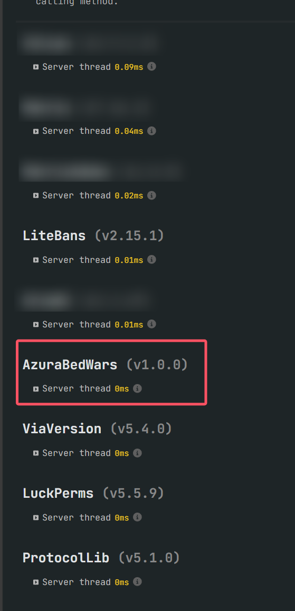

# AzuraBedWars

[English](README.md) | [中文](README_CN.md)

---

一个正在开发的BedWars(起床战争)插件

## 项目简介

AzuraBedWars是一个基于Spigot/Paper的Minecraft床战插件。该项目目前正在开发中。

### 前言

- 此项目并未完成，还差很多的特性才能完成，计划维护至2.0.0版本
- 我们计划支持1.8-1.21+版本，但很可惜目前只在1.8.8版本进行开发测试
- 如果使用此项目请自行负责遇到的任何问题，我们只建议用来测试使用，不要放到生产环境
- 如果你有建议和发现的问题，可以在issue提出，我们会考虑尽快支持
- 本人并不是很熟悉BukkitAPI等，可能项目里有很多有歧义的地方

### 结构解释

- `azurabedwars-plugin` — Minecraft BedWars 插件
- `azurabedwars-dashboard` — Spring Boot 后台管理系统，本质是一个网站，用来动态管理运行azurabedwars-plugin的服务器的配置等

## 性能展示

- 这是在16人对局完成后的spark profiler结果，或许这是能吸引您选择我们项目的原因(打码的都是反作弊插件)

## 快速开始

### 成品测试端

- [AzuraBedWars-DemoServer](https://github.com/MindsMaster/AzuraBedWars-DemoServer)
- 你可以在这里打包下载成品测试端来直接使用

### 运行要求

- **Java**: 17 或更高版本
- **Minecraft**: 1.8.8
- **数据存储**: MySQL (必须)
- **依赖插件**:
    - PacketEvents (必装)
    - Vault (可选)
    - LuckPerms (可选)

## 贡献

我们欢迎所有形式的贡献！无论是报告bug、提出新功能建议，还是提交代码，我们都非常感激。

### 如何贡献

1. **Fork项目**
2. **创建功能分支** (`git checkout -b feature/YourFeatureName`)
3. **提交更改** (`git commit -m 'Add some AmazingFeature'`)
4. **推送到分支** (`git push origin feature/YourFeatureName`)
5. **创建Pull Request (请推送至develop分支)**

### 代码规范

- 遵循Java编码规范
- 使用有意义的变量和方法名
- 添加适当的注释
- 确保代码通过所有测试

## 许可证

本项目采用GNU Affero General Public License v3.0 (AGPL-3.0) 许可证

## 作者

- **An5w1r_** - 主要开发者
- **Ant1Aura** - 贡献者
- **ImCur_** - 贡献者

## 联系方式

- **邮箱**: an5w1r@163.com
- **QQ群**: 1046048297

## 免责声明

本项目目前处于开发阶段，可能存在不稳定的功能。在生产环境中使用前，请充分测试。

---

⭐ 如果这个项目对你有帮助，请给我们一个星标！ 
